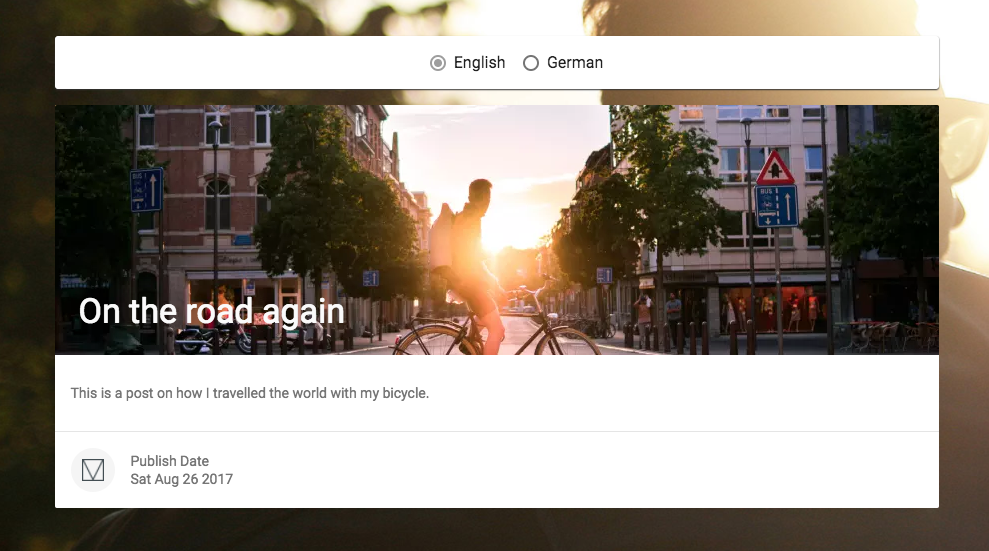

# Contentful localization and image resizing example



This is an example repo to show how to implemement localization and server side image resizing.

## Features

This projects shows how you can quickly build things including different languages.

### Localization

```javascript
// fetch an entry with a given id
// in a particular language
client.getEntries({
  'sys.id' : '7EGoqR4kEwgk4c4yscUQ4I',
  locale: 'de'
}).then(response => {
  const entry = response.items[0];

  // do something with the entry
  // ...
  // ...
})
```

### Server side image resizing

This source code below makes use of several Contentful Images API features. It uses `w` (width), `h` (height), `fit` (resizing behavor) and `fm` (format) parameters. Using these it is possible to fetch images exactly like you need them.

```html
<picture>
  <!-- image 884px wide, 250px high, resized and cropped to fit delivered in webp -->
  <source srcset="//images.contentful.com/.../tobias-cornille-301605.jpg?w=884&h=250&fit=fill&fm=webp" type='image/webp'>
  <!-- image 884px wide, 250px high, resized and cropped to fit delivered in jpg -->
  
</picture>
```

## Set it up yourself

```
$ git clone git@github.com:contentful-developer-relations/web-localization-example.git
$ cd web-localization-example.git
```

Create a new space either by using [contentful-cli](https://www.npmjs.com/package/contentful-cli) or [app.contentful.com](https://app.contentful.com).

```
# using the cli
$ contentful space create --name "Localization example"
```

After that you can use [contentful-import](https://www.npmjs.com/package/contentful-import) to import the data in your own space.

```
# import the data
$ contentful-import --space-id YOUR_NEW_SPACE --contentful ./exports/contentful-export.json
```

Adjust the SDK client to use your new space.

```javascript
const client = contentful.createClient({
  space: 'YOUR_SPACE_ID',
  accessToken: 'YOUR_ACCESS_TOKEN'
});
```
